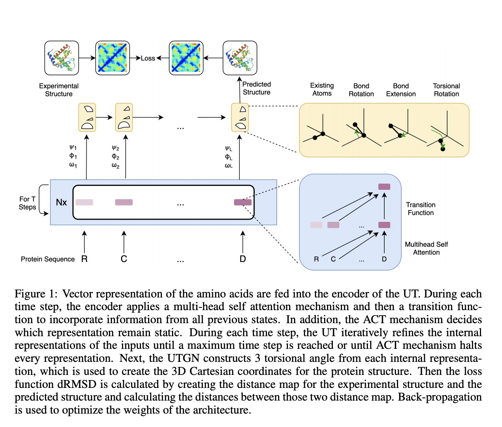

# Universal Transforming Networks
This is the Tensorflow implementation of [Universal Transforming Geometric Networks](https://arxiv.org/abs/1908.00723) (UTGN). See [here](https://github.com/JinLi711/UTGN/blob/master/UTGN%20Presentation.pdf) for a slideshow presentation.



## Installation and requirements
Download the files [here](https://github.com/JinLi711/UTGN/tree/master/UTGN) and use `main.py`, described further below, to train new models and predict structures. Below are the language requirements and package dependencies:

* Python 3.7
* TensorFlow >= 1.4 (tested up to 1.12)

## Usage
The [`main.py`](https://github.com/JinLi711/UTGN/blob/master/UTGN/model/main.py) script facilities training of and prediction using UTGN models. Below are typical use cases. The script also accepts a number of command-line options whose functionality can be queried using the `--help` option.

### Train a new model or continue training an existing model
UTGN models are described using a configuration file that controls hyperparameters and architectural choices. For a list of available options and their descriptions, see its [documentation](https://github.com/JinLi711/UTGN/blob/master/CONFIG.md). Once a configuration file has been created, along with a suitable dataset (download a ready-made [ProteinNet](https://github.com/aqlaboratory/proteinnet) data set or create a new one from scratch using the [`convert_to_tfrecord.py`](https://github.com/JinLi711/UTGN/blob/master/UTGN/data_processing/convert_to_tfrecord.py) script), the following directory structure must be created:

```
<baseDirectory>/runs/<runName>/<datasetName>/<configurationFile>
<baseDirectory>/data/<datasetName>/[training,validation,testing]
```

Where the first path points to the configuration file and the second path to the directories containing the training, validation, and possibly test sets. Note that `<runName>` and `<datasetName>` are user-defined variables specified in the configuration file that encode the name of the model and dataset, respectively.

Training of a new model can then be invoked by calling:

```
python main.py <configurationFilePath> -d <baseDirectory>
```

Download a pre-trained model for an example of a correctly defined directory structure. Note that ProteinNet training sets come in multiple "thinnings" and only one should be used at a time by placing it in the main training directory.

To resume training an existing model, run the command above for a previously trained model with saved checkpoints.

### Predict sequences in ProteinNet TFRecords format using a trained model
To predict the structures of proteins already in ProteinNet `TFRecord` format using an existing model with a saved checkpoint, call:

```
python main.py <configFilePath> -d <baseDirectory> -p
```

This predicts the structures of the dataset specified in the configuration file. By default only the validation set is predicted, but this can be changed using the `-e` option, e.g. `-e weighted_testing` to predict the test set.

### Predict structure of a single new sequence using a trained model
If all you have is a single sequence for which you wish to make a prediction, there are multiple steps that must be performed. First, a PSSM needs to be created by running JackHMMer (or a similar tool) against a sequence database, the resulting PSSM must be combined with the sequence in a ProteinNet record, and the file must be converted to the `TFRecord` format. Predictions can then be made as previously described.

Below is an example of how to do this using the supplied scripts (in [data_processing](https://github.com/JinLi711/UTGN/tree/master/UTGN/data_processing)) and one of the pre-trained models, assumed to be unzipped in `<baseDirectory>`. HMMER must also be installed. The raw sequence databases (`<fastaDatabase>`) used in building PSSMs can be obtained from [here](https://github.com/aqlaboratory/proteinnet/blob/master/docs/raw_data.md). The script below assumes that `<sequenceFile>` only contains a single sequence in the FASTA file format.

```
jackhmmer.sh <sequenceFile> <fastaDatabase>
python convert_to_proteinnet.py <sequenceFile>
python convert_to_tfrecord.py <sequenceFile>.proteinnet <sequenceFile>.tfrecord 42
cp <sequenceFile>.tfrecord <baseDirectory>/data/<datasetName>/testing/
python protling.py <baseDirectory>/runs/<runName>/<datasetName>/<configurationFile> -d <baseDirectory> -p -e weighted_testing
```

The first line searches the supplied database for matches to the supplied sequence and extracts a PSSM out of the results. It will generate multiple new files. These are then used in the second line to construct a text-based ProteinNet file (with 42 entries per evolutionary profile, compatible with the pre-trained UTGN models). The third line converts the file to `TFRecords` format, and the fourth line copies the file to the testing directory of a pre-trained model. Finally the fifth line predicts the structure using the pre-trained UTGN model. The outputs will be placed in  `<baseDirectory>/runs/<runName>/<datasetName>/<latestIterationNumber>/outputsTesting/` and will be comprised of two files: a `.tertiary` file which contains the atomic coordinates, and `.recurrent_states` file which contains the UTGN latent representation of the sequence.


## Acknowledgements
This work is a modification of: [End-to-end differentiable learning of protein structure, Cell Systems 2019](https://www.cell.com/cell-systems/fulltext/S2405-4712(19)30076-6)

The code is a modification of: [RGN](https://github.com/aqlaboratory/rgn) by AQ Lab.

The major modifications include:
* changing code from python2 to python3
* reformating the code for computer programmers
* comments for every function
* added in transformer variants

